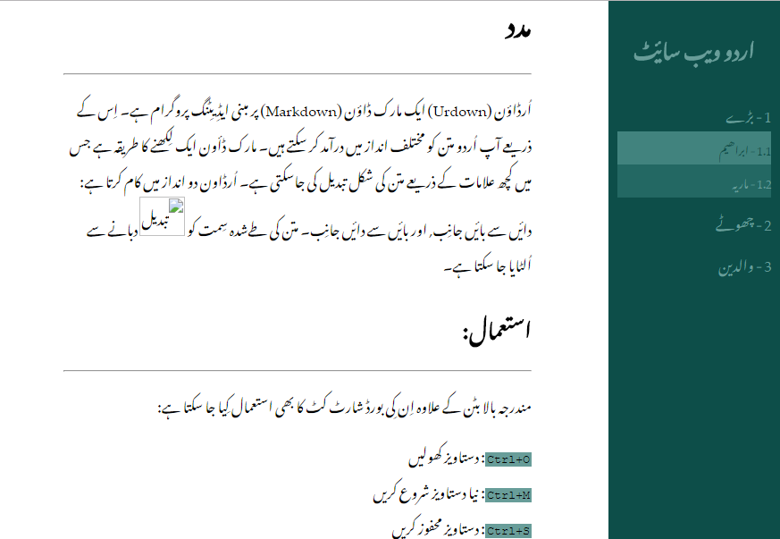
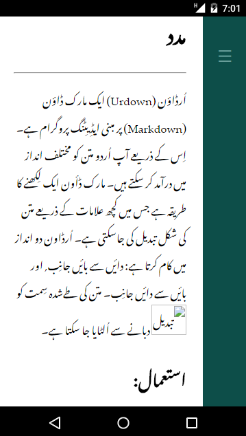

# HugoWiki
A hugo theme for tutorials. _HugoWiki_ is compatible with right-to-left languages like Urdu. It can also work with left-to-right languages (see Usage).





## Usage
Content in _HugoWiki_ is divided into parts and subparts. There are no taxonomies (tags, categories etc.) or sections. First, clone the theme into your `Site\Themes\` directory. Then add the parameters to your site `config` file.

```toml
baseurl = "http://example.org/"     # name of webaddress of this site
languageCode = "ur"   # ur -> Urdu
title = "اردو ویب سایٔٹ"
theme = "HugoWiki"

[params]
    dir = "rtl"       # right-to-left. For left-to-right use "ltr"
    shownums = true   # show part/subpart numbers in sidebar  

    [params.parts]
        "1" = "بڑے"
        "2" = "چھوٹے"
        "3" = "والدین"
        "NUMBER" = "PART NAME"

```
Now you can start adding content like so:

```
> hugo new wiki/my-first-post.md
```

For each content item, the following parameters will be set:

```toml
title = ""
description = ""
part = "0"            # should be a number (enclosed in quotes)
subpart = "0"         # should be of the form "PART.SUBPART_NUMBER"
hascode = false       # if true, Highlight.js is loaded for syntax highlighting
hasmath = false       # if true, MathJax is loaded for LaTeX style formatting

```

To populate the main page, create file `content\_index.md` in your site directory.
Regular markdown rules apply.

To enter content in the opposite direction to that of the site, wrap makrdown in:

```
{}
Left to Right text
{}

{}
Right to Left text
{}

```
